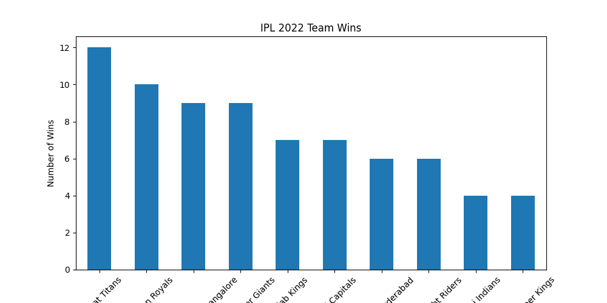
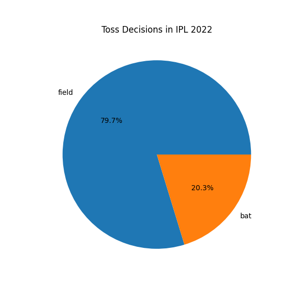
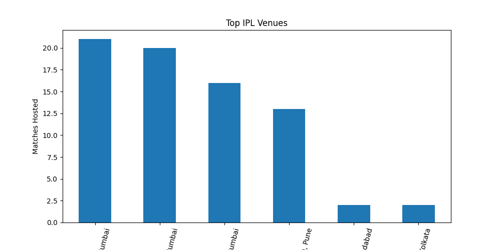
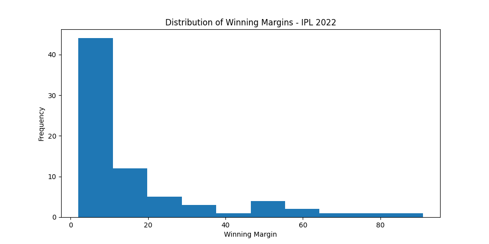
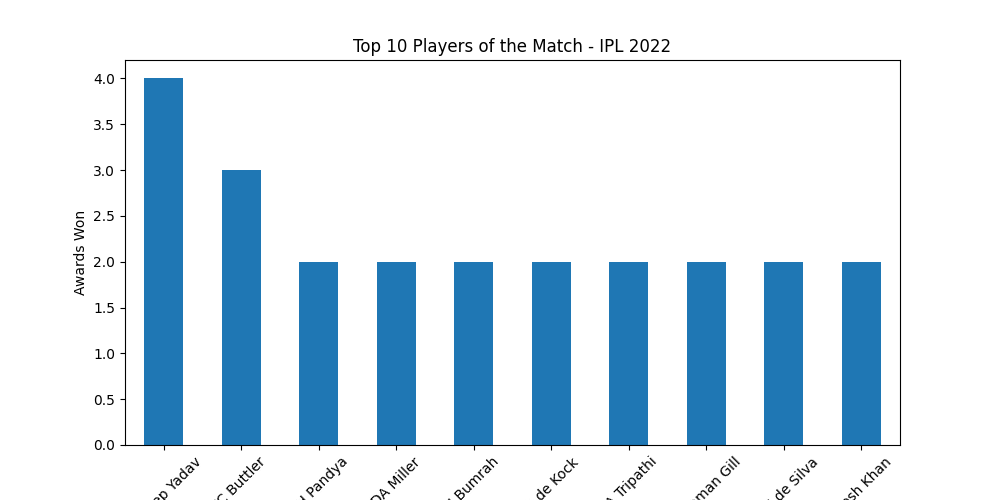

# IPL 2022 Data Analysis Project

## Project Overview
This project analyzes IPL 2022 match data using Python, Pandas, and Matplotlib.

The goal of this project is to identify trends, patterns, and insights from IPL match datasets through statistical analysis and data visualization.

---

## Technologies Used
- Python
- Pandas
- Matplotlib

---

## Dataset
Dataset used:
- IPL_Matches_2022.csv

Source:
- Kaggle IPL 2022 Dataset

---

## Analysis Performed

### 1. Team Wins Analysis
- Identified teams with highest wins
- Gujarat Titans emerged as top-performing team

### 2. Toss Impact Analysis
- Analyzed relationship between toss winners and match winners
- Found toss had moderate influence on outcomes

### 3. Venue Analysis
- Compared number of matches hosted by different stadiums

### 4. Toss Decision Analysis
- Visualized batting vs fielding decisions after toss wins

### 5. Player Performance Analysis
- Identified top “Player of the Match” performers

### 6. Winning Margin Distribution
- Used histogram analysis to study match competitiveness

### 7. Correlation Analysis
- Explored statistical relationships between numerical match data

---

## Data Visualization
The project includes:
- Bar Charts
- Pie Charts
- Histograms

Charts are saved inside the `charts/` folder.

---

## Key Skills Demonstrated
- Data Analysis
- Data Visualization
- Statistical Analysis
- Python Programming
- Dataset Handling
- Data Cleaning
- Insight Generation

## Features
- Team win analysis
- Toss decision analysis
- Venue analysis
- Winning margin analysis
- Player performance visualization

---

## Charts Generated
- Team wins bar chart
- Toss decision pie chart
- Venue analysis chart
- Winning margin histogram
- Top players chart

---

## Conclusion
- Gujarat Titans won the highest matches in IPL 2022
- Toss decisions influenced match outcomes
- Some venues showed higher winning margins
- Data visualization helped identify trends clearly

---

## Future Improvements
- Add Power BI dashboard
- Add SQL analysis
- Add machine learning prediction
- Analyze ball-by-ball IPL dataset

---
## Project Screenshots

### Team Wins Analysis

---

### Toss Decision Analysis

---

### Venue Analysis

---

### Winning Margin Histogram

---

### Top Players Analysis

## Features

- Team win analysis
- Toss decision analysis
- Venue analysis
- Winning margin analysis
- Top player analysis
- Data visualization using charts

---

## Project Screenshots

### Team Wins Analysis

### Toss Decision Analysis

### Venue Analysis

### Winning Margin Histogram

### Top Players Analysis

---

## Conclusion

This project demonstrates beginner-to-intermediate level data analytics skills using Python, Pandas, and Matplotlib.

## Conclusion
This project demonstrates beginner-to-intermediate level data analytics skills using real IPL match datasets.

The analysis helped identify performance trends, venue patterns, toss impacts, and player statistics through visual and statistical methods.